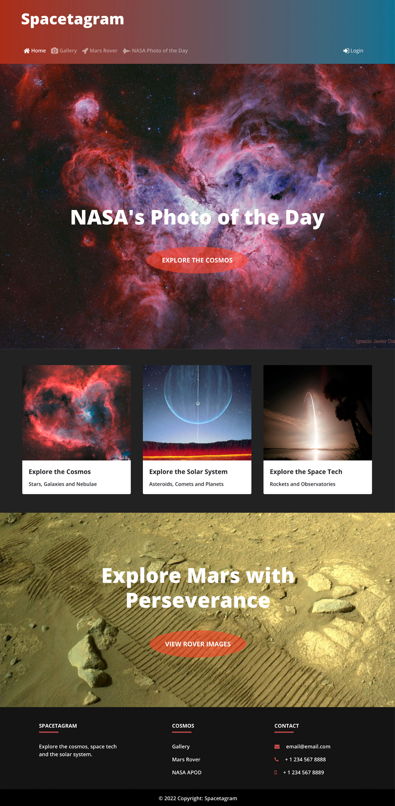

# Spacetagram

This project was developed to practice applying the concepts I learned while taking classes on React and Redux and to practice fetching data from an api. The api used is NASA's Astronomy Picture of the Day.

[View the site](https://dereklien218.github.io/spacetagram-site/)

## User Interface

This site was developed with React utilizing React Router to navigate between pages and Redux for state management.

## NASA Api

This project uses the DEMO_KEY api key which limits you to 30 requests per hour and 50 requests per day. You can register for your own free API key at [api.nasa.gov](https://api.nasa.gov/), which will increase the daily limit to 1000 requests per hour and no daily limit. If you register for your own api key, open the .env file and replace DEMO_KEY with your api key. Then add .env to the .gitignore file.

## How to run

Clone this repo and then run:

### `yarn install`

Installs required dependencies.

### `yarn start`

Runs the app in the development mode.\
Open [http://localhost:3000](http://localhost:3000) to view it in your browser.

The page will reload when you make changes.\
You may also see any lint errors in the console.
